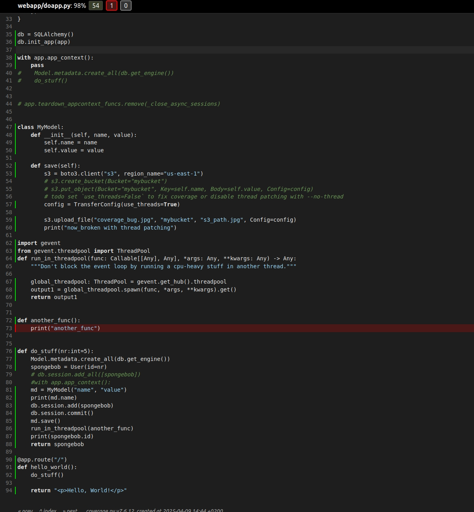
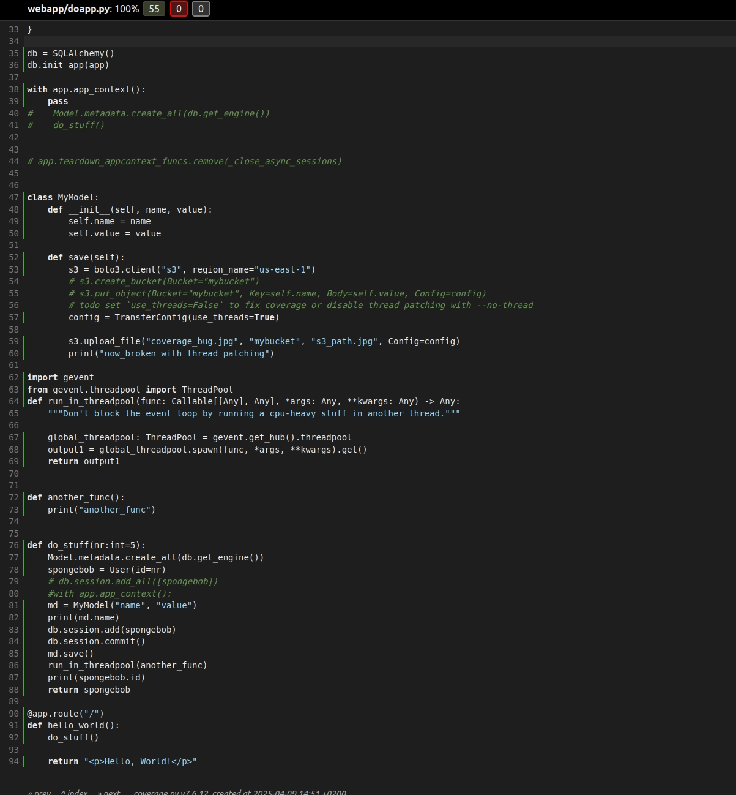

Bug on coverage:

python -m gevent.monkey --module pytest tests/ --cov=webapp --cov-report html -s

Works ok with `--no-thread` and setting `concurrency = ["gevent", "thread", "multiprocessing"]` in `tool.coverage.run` in `pyproject.toml`:

python -m gevent.monkey --no-thread --module pytest tests/ --cov=webapp --cov-report html -s

